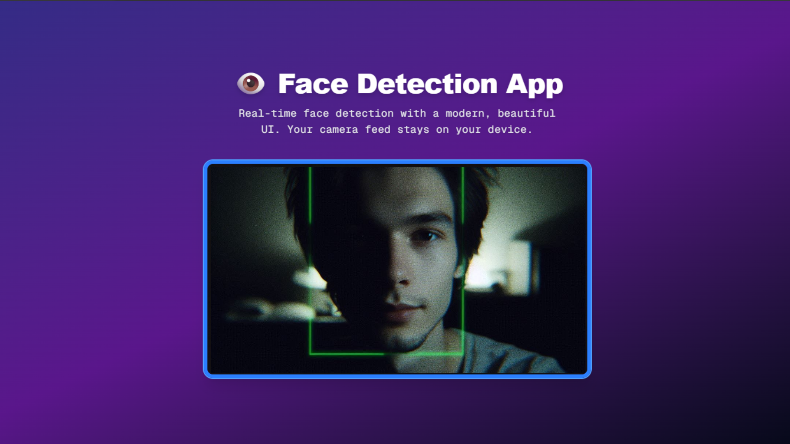

# 👁️ Face Detection App

A sleek real-time face detection web app built with **Next.js**, **Tailwind CSS**, and **face-api.js**. It uses your webcam to detect faces and draw bounding boxes — all processed on your device to ensure privacy.

---

## 🚀 Features

- 🎥 Real-time face detection via webcam
- 🧠 Uses `face-api.js` with `TinyFaceDetector`
- 📦 Built with Next.js App Router (`app/` directory)
- 💅 Styled using Tailwind CSS and modern UI principles
- 🎬 Start/Stop video recording with face boxes
- 🔐 100% on-device processing — no backend or data sharing

---

## 📸 Screenshots

### 🟢 Live Face Detection



---

## 🛠️ Tech Stack

- **Framework**: [Next.js](https://nextjs.org/)
- **Face Detection**: [face-api.js](https://github.com/justadudewhohacks/face-api.js)
- **Styling**: [Tailwind CSS](https://tailwindcss.com/)
- **Recording**: MediaRecorder API + Canvas Stream

---

## 🧑‍💻 Local Setup

1. **Clone the repository**

   ```bash
   git clone https://github.com/Tilak46/face-detection-app.git
   cd face-detection-app
   ```

2. **Install dependencies**

   ```bash
   npm install
   ```

3. **Download face-api.js models**

   - Place all model files from [here](https://github.com/justadudewhohacks/face-api.js-models) into:
     ```
     public/models/
     ```

4. **Run the development server**

   ```bash
   npm run dev
   ```

5. **Visit**: [http://localhost:3000](http://localhost:3000)

---

## 🌐 Live Demo

> 🔗 [Vercel Live Link](https://face-detection-app-by-tilak.vercel.app/)

---

## 📁 Folder Structure

```
.
├── public/
│   ├── models/          # face-api.js model files
│   └── screenshots/     # placeholder for screenshots
├── src/
│   ├── app/
│   │   └── page.js      # Main page using FaceTracker
│   └── components/
│       └── FaceTracker.js
├── .gitignore
├── tailwind.config.js
└── README.md
```

---

## 📜 License

This project is licensed under the **MIT License** — feel free to use, modify, and share!

---

## 💡 Credits

Created with ❤️ by [Tilak R](https://github.com/Tilak46)  
Powered by [face-api.js](https://github.com/justadudewhohacks/face-api.js)

---
